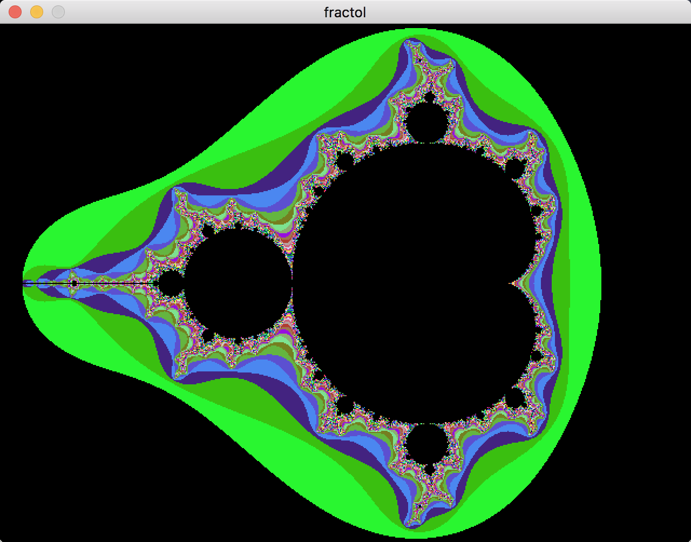
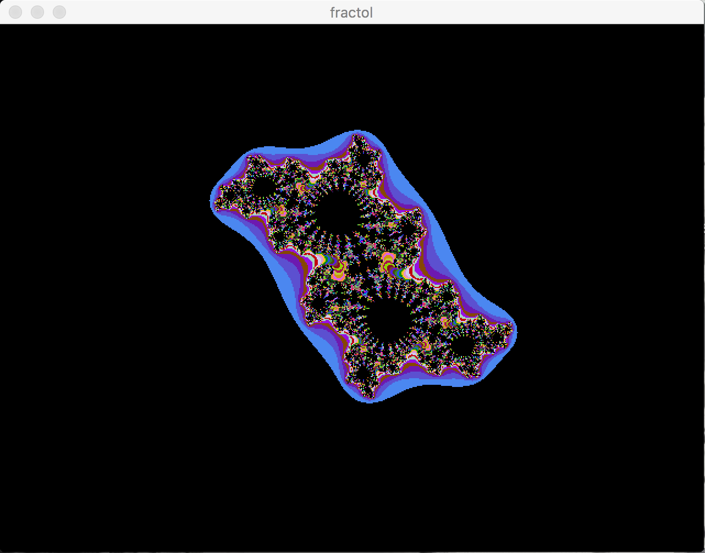
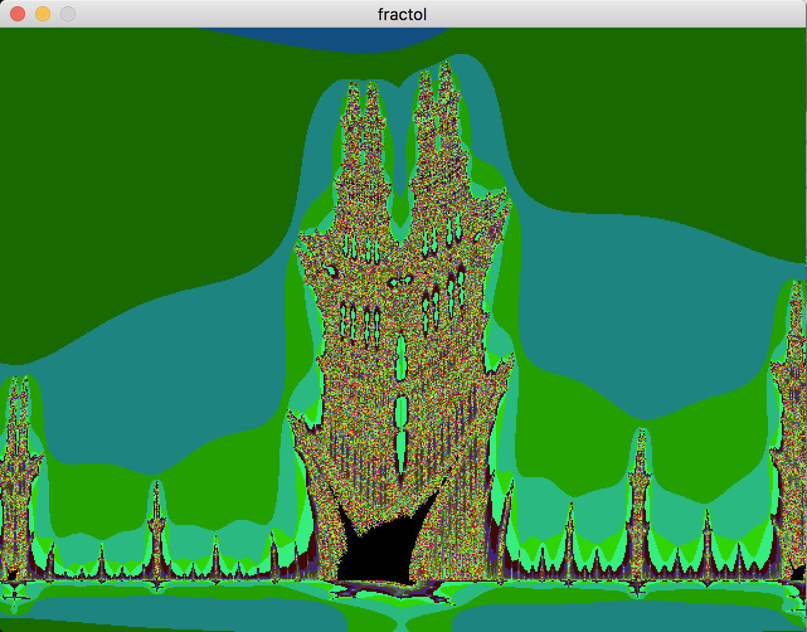

# fract-ol
Project of Le 101 School.

The point of this project was to make a fractal renderer that can show at least 3 fractals. We can zoom on fractals. It must comply with the norm imposed by the school. We also couldn't use many external functions and libraries, making us re-code almost everything.
Only works on Mac OS (for now).

TODO: Adapt to all platforms and lower mouse latency by changing parsing.

# Screenshots

